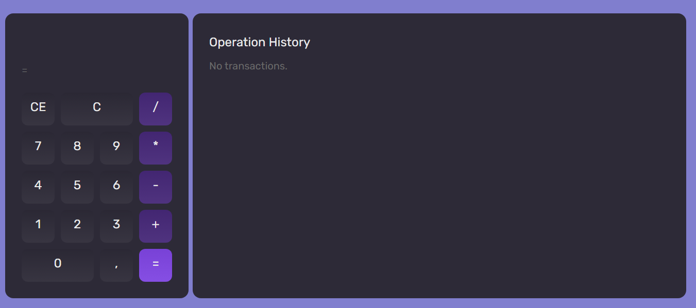
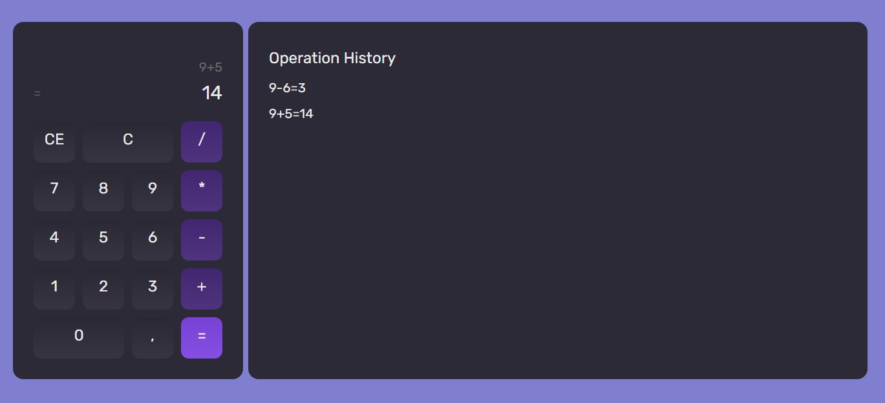

Project for reviewing the ReactJS fundamentals. 
Appling on the calculator:

1) Open calculator

2) Doing some operation, and the operation history 

Reviewing: 
- components
- properties
- events
- states
- conditionas
- lists
- filter
- context
- effects